# React Portfolio Website

A full-stack portfolio application with a Node.js/Express backend and React frontend. The application provides RESTful APIs for managing education, skills, projects, and work experiences, with data stored in MongoDB.

## Tech Stack

### Backend
- Node.js
- Express.js
- MongoDB (with Mongoose)
- CORS

### Frontend
- React
- Material UI
- Axios

## Project Structure
```
portfolio-project/
├── portfolio-backend/
│   ├── config/
│   │   └── db.js
│   ├── controllers/
│   │   ├── educationController.js
│   │   ├── experienceController.js
│   │   ├── projectController.js
│   │   └── skillController.js
│   ├── models/
│   │   ├── Education.js
│   │   ├── Experience.js
│   │   ├── Project.js
│   │   └── Skill.js
│   ├── routes/
│   │   ├── educationRoutes.js
│   │   ├── experienceRoutes.js
│   │   ├── projectRoutes.js
│   │   └── skillRoutes.js
│   ├── .env
│   ├── server.js
│   └── package.json
│
└── portfolio-frontend/
    ├── public/
    ├── src/
    │   ├── assets/
    │   ├── components/
    │   ├── context/
    │   ├── layouts/
    │   ├── pages/
    │   ├── services/
    │   └── theme/
    ├── .env
    └── package.json
```

## Setup Instructions

- Node.js 
- MongoDB 

### Backend Setup
1. Navigate to the backend folder:
   ```
   cd portfolio-backend
   ```

2. Install dependencies:
   ```
   npm install
   ```

3. Create a `.env` file with the following variables:
   ```
   NODE_ENV=development
   PORT=5000
   MONGO_URI=your_mongodb_connection_string
   ```

4. Start the backend server:
   ```
   npm run dev
   ```
   The server will run on http://localhost:5000

### Frontend Setup
1. Navigate to the frontend folder:
   ```
   cd portfolio-frontend
   ```

2. Install dependencies:
   ```
   npm install
   ```

3. Create a `.env` file with:
   ```
   REACT_APP_API_URL=http://localhost:5000
   ```

4. Start the frontend application:
   ```
   npm start
   ```
   The application will run on http://localhost:3000

## API Documentation

### Education API
- `GET /api/education` - Get all education entries
- `POST /api/education` - Create a new education entry
- `PUT /api/education/:id` - Update an education entry
- `DELETE /api/education/:id` - Delete an education entry

### Skills API
- `GET /api/skills` - Get all skills
- `POST /api/skills` - Create a new skill
- `PUT /api/skills/:id` - Update a skill
- `DELETE /api/skills/:id` - Delete a skill

### Projects API
- `GET /api/projects` - Get all projects
- `POST /api/projects` - Create a new project
- `PUT /api/projects/:id` - Update a project
- `DELETE /api/projects/:id` - Delete a project

### Experience API
- `GET /api/experience` - Get all experience entries
- `POST /api/experience` - Create a new experience entry
- `PUT /api/experience/:id` - Update an experience entry
- `DELETE /api/experience/:id` - Delete an experience entry

## Frontend Integration

The frontend uses Axios to communicate with the backend API. 
The integration includes:
- Service modules for each API endpoint
- Loading states for data fetching
- Error handling for API requests
- Dynamic rendering of data from the API

## Testing

API endpoints can be tested using Postman. Example requests:

### Create Education Entry
```
POST http://localhost:5000/api/education
Content-Type: application/json

{
  "institution": "ITU",
  "degree": "Bachelor's in Computer Science",
  "field": "Computer Science",
  "startDate": "2020-09-01",
  "endDate": "2024-06-30",
  "description": "Studied computer science fundamentals",
  "current": false
}
```

### Create Skill
```
POST http://localhost:5000/api/skills
Content-Type: application/json

{
  "name": "Web Scraping",
  "level": "Advanced",
  "category": "development"
}
```


## Screenshots
### Home Page
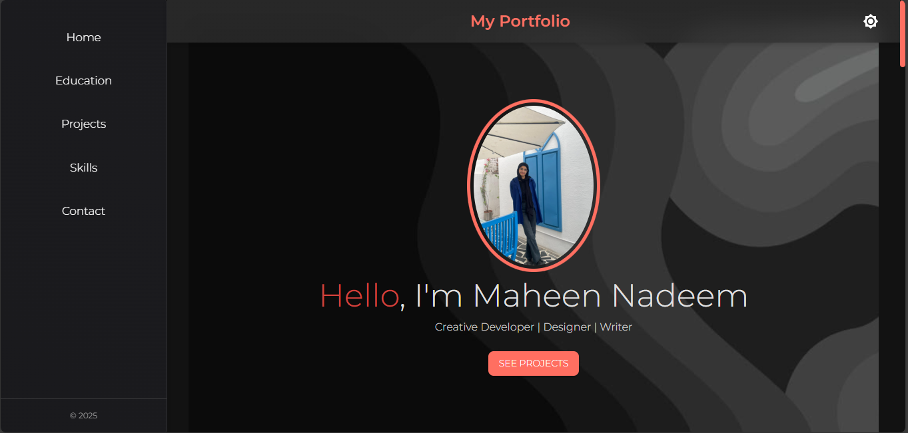

### Education Page
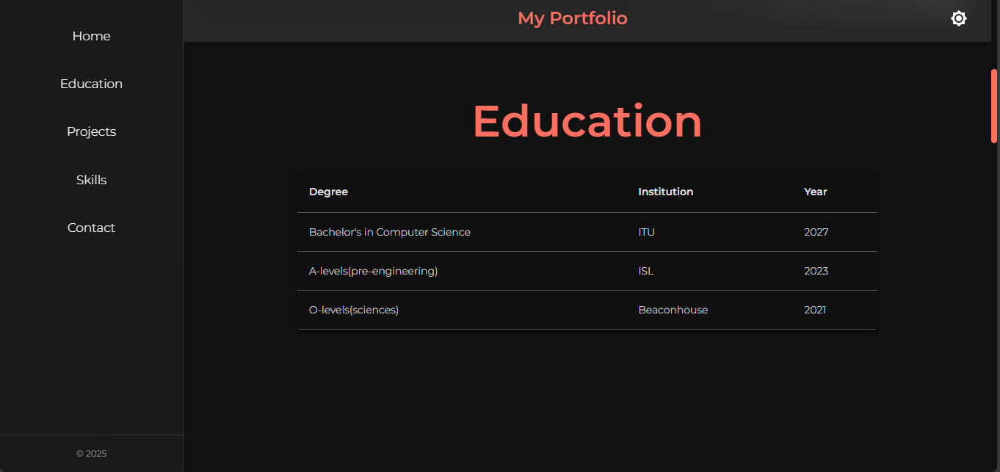

### Projects Page
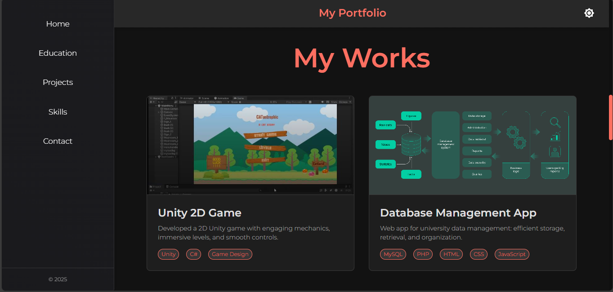

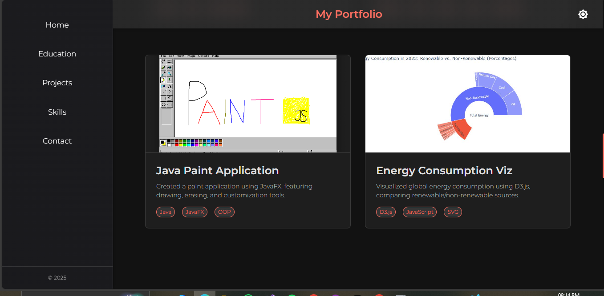

### Skills Page
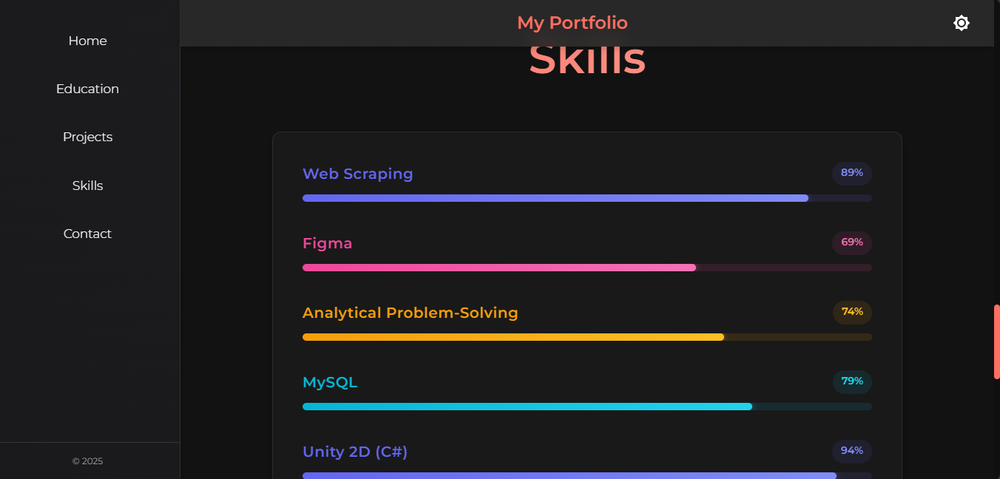

### Contact Page
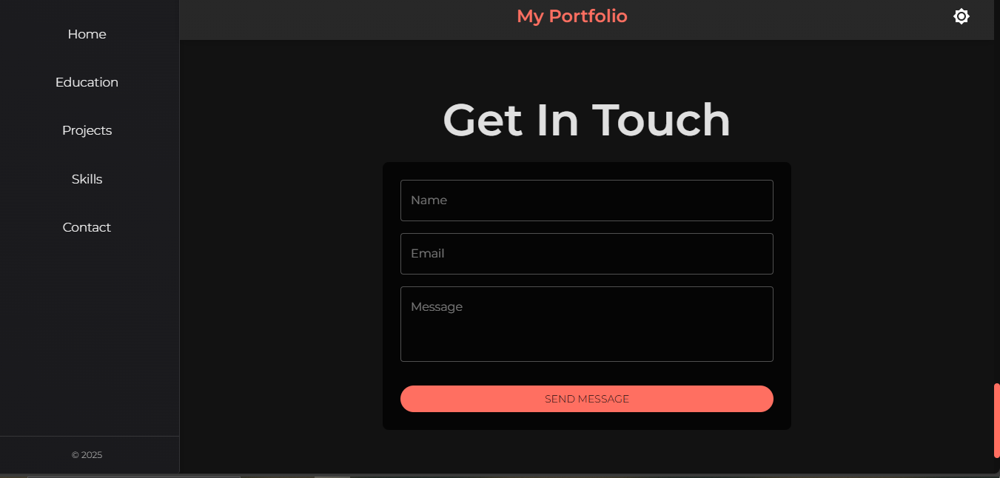

##Postman Responses
###Skills
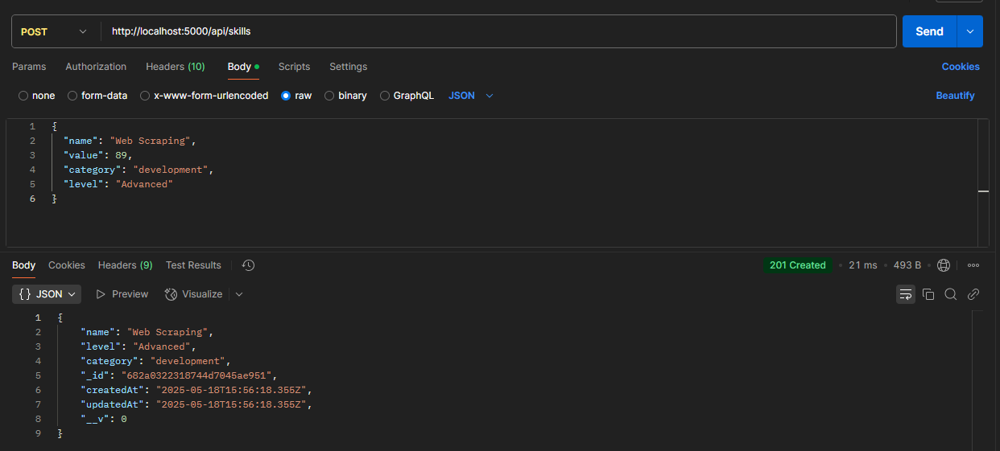

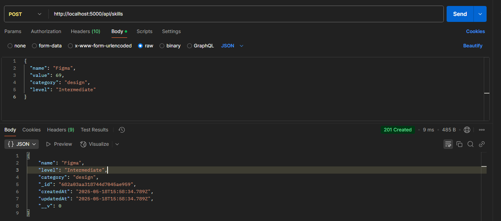

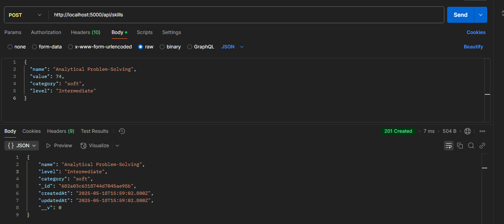

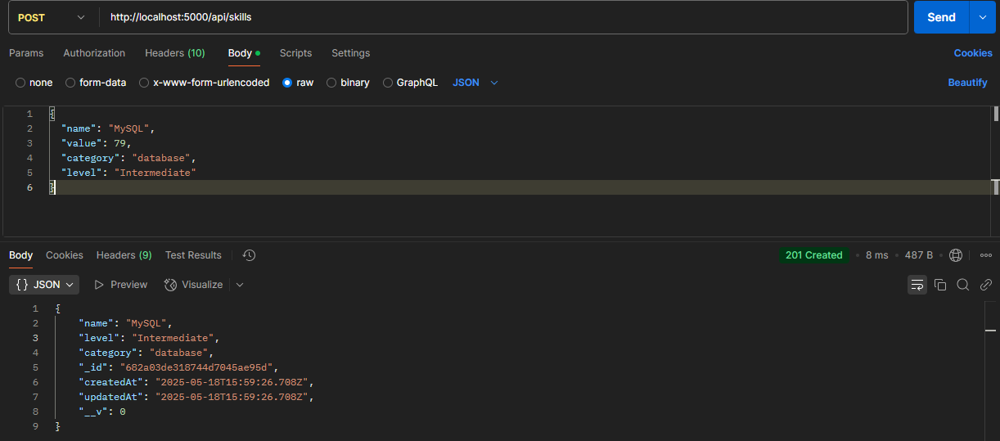

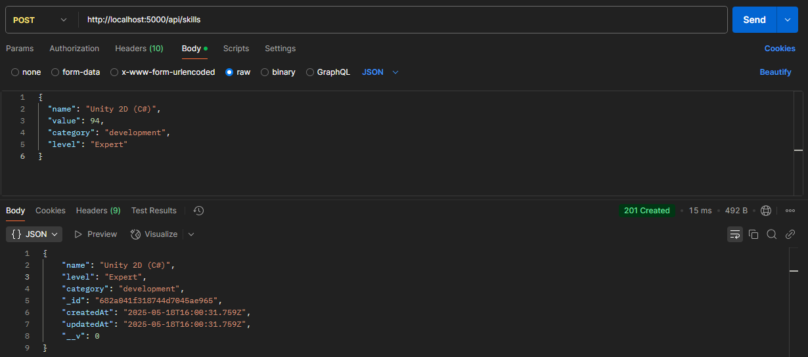

###Education
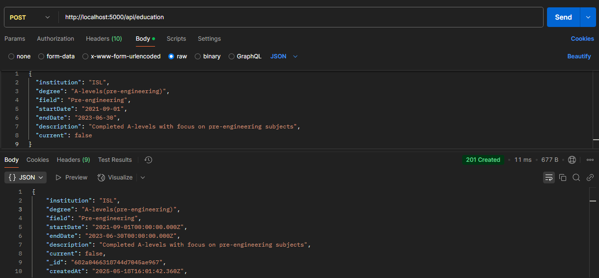

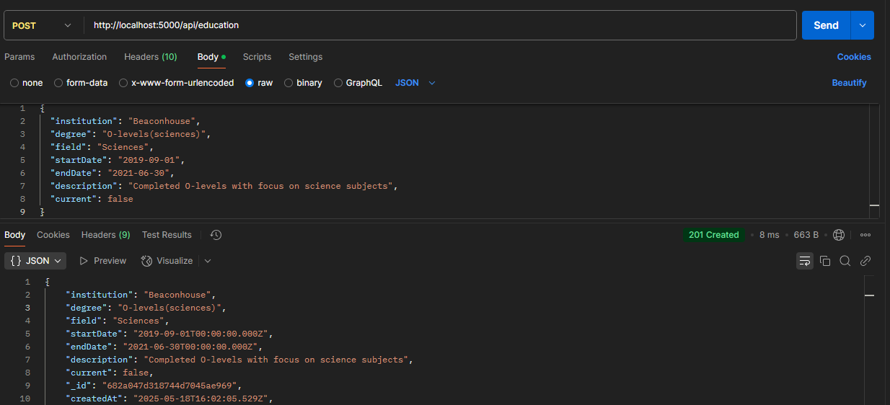

###Projects
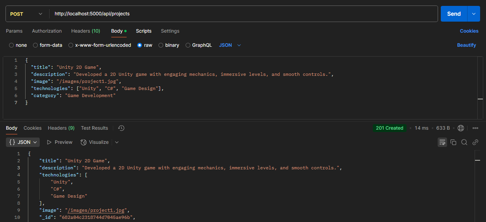

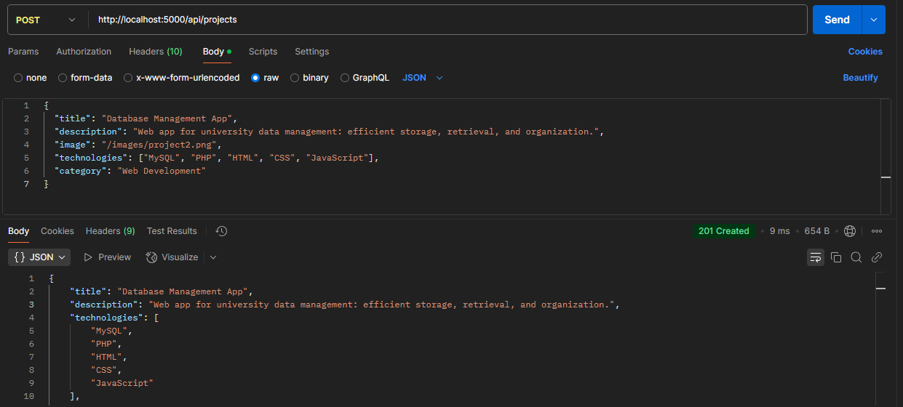

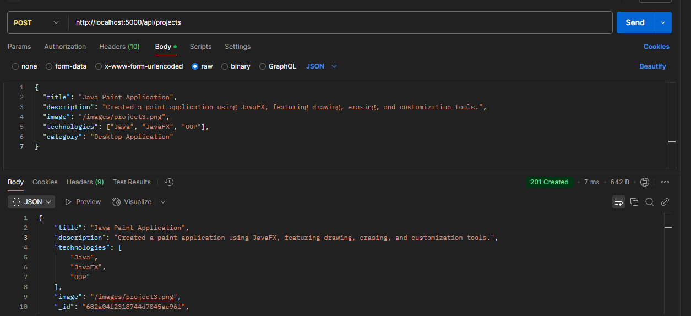

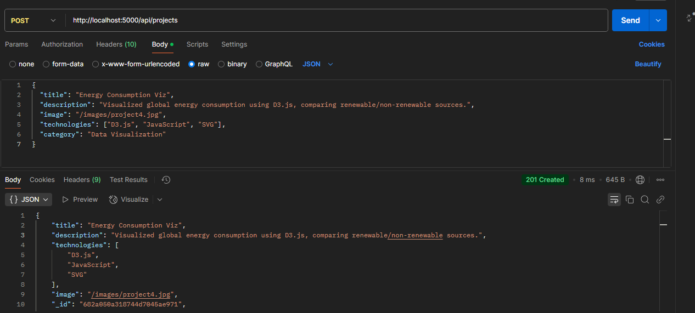


